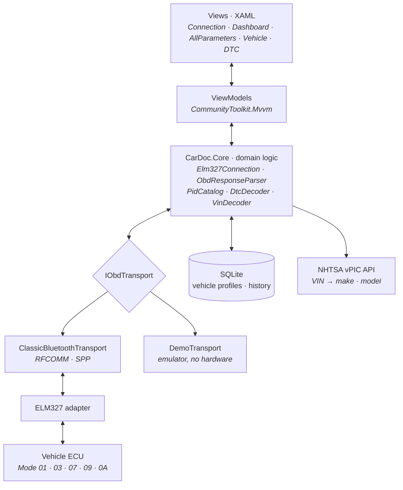

<div align="center">

# CarDoc

**An OBD-II diagnostics client for Android, built with .NET MAUI**

Reads everything a car is willing to tell you — live engine parameters, trouble codes, VIN —
and shows it in plain language instead of hexadecimal.

[](https://dotnet.microsoft.com/)
[](https://learn.microsoft.com/dotnet/maui/)
[](#verified-hardware)
[](#roadmap)

[Українською](README.uk.md)

</div>

---

## Why

When the check engine light comes on, a typical scanner shows you `P0299` and stops there.
The driver either pays a shop for a diagnosis they could have run themselves, or searches
the code on their phone by the roadside.

CarDoc starts from a different premise: **the data is already available — the problem is how
it's presented.** The app reads whatever the ECU exposes, renders it in a form a human can
act on, and knows which parameters a given car actually supports. A 2010 Renault and a 2015
Mitsubishi expose different PID sets, and an empty "—" tile is worse than no tile at all.

---

## Features

| | Feature | Status |
|---|---|---|
| ● | ELM327 connection over Bluetooth Classic (RFCOMM/SPP) | in progress |
| ● | Automatic bus protocol detection, cached per vehicle | in progress |
| ● | Live dashboard: RPM, speed, temperatures, engine load | in progress |
| ● | Supported-PID discovery and a full list of everything the car exposes | in progress |
| ● | VIN read with make, model, year and engine resolution | in progress |
| ● | Trouble codes: active, pending, permanent | in progress |
| ○ | Manufacturer-specific parameters (Mode 21/22 by module address) | planned |
| ○ | CSV session export | planned |
| ○ | Plain-language fault explanations via a dedicated backend | phase 2 |

---

## Architecture

Signal flows bottom-up: vehicle bus → adapter → transport → domain logic → view models →
screens. Every layer talks to its neighbour **through an interface only**.



Three decisions everything else rests on:

**`CarDoc.Core` has no MAUI dependency.** It's an ordinary class library with no
`using Microsoft.Maui` anywhere. That keeps unit tests running in seconds without the Android
workload, and lets the same logic back a console tool or a separate Android Auto head.

**`DemoTransport` is a real implementation, not a stub.** It replays a recorded log from an
actual vehicle, so the entire UI can be exercised in an emulator with no adapter on hand.
That is also what makes the repository reproducible — anyone can clone it and see it run.

**A foreground service owns the connection, not a page.** Otherwise Android tears down polling
the moment the app is backgrounded, which is exactly when a driver needs it running.

---

## Verified hardware

The protocol handling here wasn't derived from documentation alone — it was confirmed on a
bench against a real car.

| Property | Value |
|---|---|
| Adapter | FNIRSI OBD2 |
| Link | Bluetooth Classic SPP (`OBDII`, PIN `1234`) |
| RFCOMM UUID | `00001101-0000-1000-8000-00805F9B34FB` |
| Firmware | `ELM327 v1.5` |
| Round trip | ~56 ms per request |
| `ATSH` / `ATCRA` | supported — non-standard module addressing is possible |
| Test vehicle | Renault Grand Espace IV 2010, 2.0 dCi |

<details>
<summary><b>Confirmed response log</b></summary>

```
ATZ    → ELM327 v1.5
ATDPN  → A8                         ISO 15765-4, CAN 11 bit, 250 kbps
0100   → 41 00 98 3B 80 11          PIDs 01,04,05,0B,0C,0D,0F,10,11,1C,1F
0120   → 41 20 A0 01 80 00          PIDs 21,23,30,31 — no further ranges
0105   → 41 05 6A                   0x6A = 106 → 106-40 = 66 °C
```

These responses are used verbatim as fixtures in the unit tests. If parsing against a real
car ever breaks, the tests fail on the actual bytes rather than on invented examples.

**One trap worth calling out:** forcing `ATSP6` (CAN 500 kbps) returned `NO DATA` — this
vehicle's bus runs at 250 kbps, protocol 8. The protocol is a property of the car, not a
constant of the app, so it's detected once and cached in a vehicle profile.

</details>

---

## Stack

| Layer | Technology |
|---|---|
| UI | .NET MAUI, XAML, `GraphicsView` for gauges |
| Pattern | MVVM via `CommunityToolkit.Mvvm` |
| DI | `Microsoft.Extensions.DependencyInjection` |
| Link | Android `BluetoothSocket`, RFCOMM |
| Storage | SQLite |
| Tests | xUnit, FluentAssertions |

---

## Repository layout

```
src/
├── CarDoc.Core/          domain logic, MAUI-free — parsers, PIDs, DTCs, VIN
└── CarDoc.App/           MAUI application, Android only
tools/
└── CarDoc.PidScanner/    console scanner for manufacturer-specific PIDs
tests/
└── CarDoc.Core.Tests/    unit tests for the domain layer
```

---

## Getting started

```bash
git clone https://github.com/<user>/cardoc-obd-maui.git
cd cardoc-obd-maui

dotnet restore
dotnet test                                    # core tests, no Android workload needed
dotnet build src/CarDoc.App -f net10.0-android
```

**In an emulator.** Launch the app and pick **Demo** on the connection screen — every screen
runs against a recorded log from a real vehicle.

**On a car.** Turn the ignition on, pair the adapter in Android settings (PIN `1234`), then
select `OBDII` in the app and connect. The first connection to an unfamiliar car spends a few
seconds detecting the bus protocol; subsequent ones are instant.

Requires the Android SDK and the MAUI workload: `dotnet workload install maui-android`.

---

## Roadmap

**Phase 1 — data acquisition** *(current)*
Transport, standard-mode decoding, vehicle identification, the full set of screens.
No AI involved: reading reliably comes first.

**Phase 2 — interpretation layer**
A FastAPI backend, natural-language fault explanations with severity assessment,
VIN recognition from a photo via ML Kit.

**Phase 3 — beyond the course**
Manufacturer-specific transmission parameters, Android Auto output, long-run logging.

---

## Academic context

Built for the **Mobile Application Development** course at Lviv Polytechnic National
University, Department of Information and Communication Technologies, group IK-31.
Chosen industry: automotive.

---

## Disclaimer

This app surfaces on-board diagnostic information and **is not a substitute for professional
diagnosis**. Clearing trouble codes erases readiness monitors and does not fix the underlying
fault. Do not interact with the app while driving.

## License

MIT
