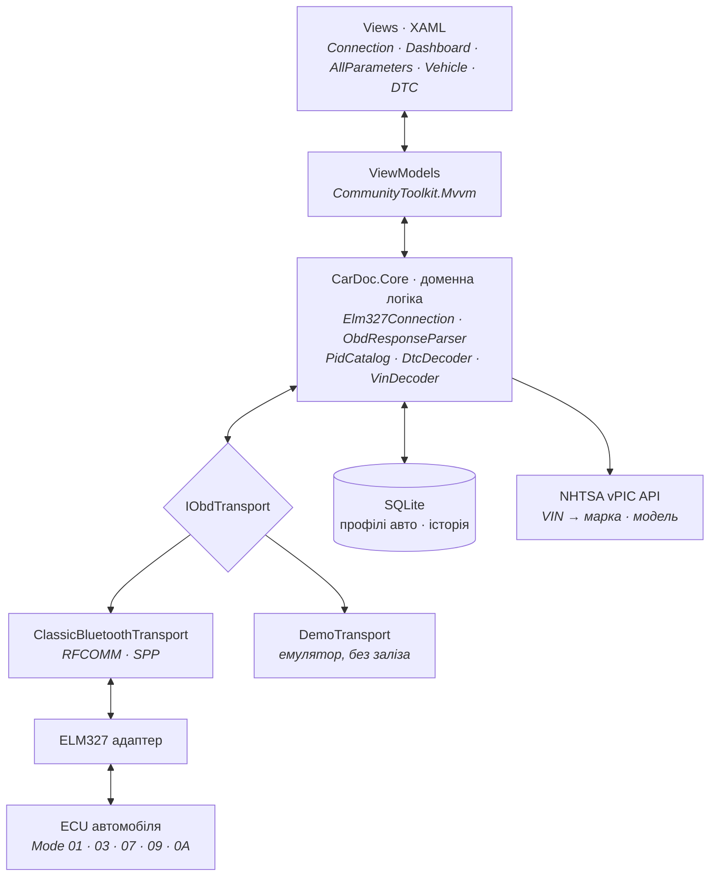

<div align="center">

# CarDoc

**Діагностичний клієнт OBD-II для Android на .NET MAUI**

Читає з автомобіля все, що той готовий віддати — стандартні параметри двигуна,
коди помилок, VIN — і показує це нормальною людською мовою замість шістнадцяткових кодів.

[](https://dotnet.microsoft.com/)
[](https://learn.microsoft.com/dotnet/maui/)
[](#перевірене-обладнання)
[](#дорожня-карта)

[In English](README.md)

</div>

---

## Навіщо це

Коли на панелі загоряється Check Engine, звичайний сканер показує `P0299` — і на цьому
допомога закінчується. Водій або їде на СТО за діагностикою, яку міг би зробити сам,
або гуглить код у телефоні на узбіччі.

CarDoc виходить з іншого припущення: **дані з автомобіля вже доступні, проблема в їхньому
поданні**. Застосунок зчитує все, що віддає ECU, показує параметри в зрозумілому вигляді
і розрізняє, які з них взагалі підтримує конкретне авто — бо Renault 2010 року та
Mitsubishi 2015-го віддають різні набори, і порожня плитка «—» гірша за її відсутність.

---

## Можливості

| | Функція | Статус |
|---|---|---|
| ● | Підключення до ELM327 по Bluetooth Classic (RFCOMM/SPP) | у розробці |
| ● | Автовизначення протоколу шини та збереження профілю авто | у розробці |
| ● | Дашборд живих параметрів: оберти, швидкість, температури, навантаження | у розробці |
| ● | Сканування підтримуваних PID і показ **усіх** доступних параметрів | у розробці |
| ● | Читання VIN, автовизначення марки, моделі, року, двигуна | у розробці |
| ● | Коди помилок: активні, очікувані, постійні | у розробці |
| ○ | Нестандартні параметри виробника (Mode 21/22 за адресою блока) | заплановано |
| ○ | Експорт сесії в CSV | заплановано |
| ○ | AI-пояснення кодів помилок через власний backend | етап 2 |

---

## Архітектура

Сигнал іде знизу вгору: шина автомобіля → адаптер → транспорт → доменна логіка →
ViewModels → екрани. Кожен шар знає про сусіда **лише через інтерфейс**.



Три рішення, на яких тримається решта:

**`CarDoc.Core` не залежить від MAUI.** Це звичайна бібліотека без жодного
`using Microsoft.Maui`. Через це юніт-тести бігають за секунди без Android workload,
а ту саму логіку може використати консольна утиліта або окремий Android Auto head.

**`DemoTransport` — повноцінна реалізація, а не заглушка.** Вона програє записаний лог
реального авто, тож весь інтерфейс перевіряється в емуляторі без адаптера під рукою.
Це ж робить проєкт відтворюваним: репозиторій запускається в будь-кого.

**З'єднанням володіє foreground service, а не сторінка.** Інакше Android обриває опитування
рівно тоді, коли застосунок згортають — тобто в найпотрібніший момент.

---

## Перевірене обладнання

Протокол не вигадувався за документацією — він підтверджений на стенді.

| Параметр | Значення |
|---|---|
| Адаптер | FNIRSI OBD2 |
| З'єднання | Bluetooth Classic SPP (`OBDII`, PIN `1234`) |
| RFCOMM UUID | `00001101-0000-1000-8000-00805F9B34FB` |
| Прошивка | `ELM327 v1.5` |
| Час відгуку | ~56 мс на запит |
| `ATSH` / `ATCRA` | підтримуються — доступна адресація нестандартних блоків |
| Тестове авто | Renault Grand Espace IV 2010, 2.0 dCi |

<details>
<summary><b>Лог підтверджених відповідей</b></summary>

```
ATZ    → ELM327 v1.5
ATDPN  → A8                         ISO 15765-4, CAN 11 bit, 250 kbps
0100   → 41 00 98 3B 80 11          PID 01,04,05,0B,0C,0D,0F,10,11,1C,1F
0120   → 41 20 A0 01 80 00          PID 21,23,30,31 — наступних діапазонів немає
0105   → 41 05 6A                   0x6A = 106 → 106-40 = 66 °C
```

Ці відповіді використані як фікстури в юніт-тестах: якщо зламається робота з реальним
авто, тести впадуть на конкретних байтах, а не абстрактних прикладах.

**Грабля, варта окремої згадки:** форсований `ATSP6` (CAN 500 kbps) давав `NO DATA` —
у цього авто шина працює на 250 kbps, тобто протокол 8. Протокол є властивістю
автомобіля, а не константою застосунку, тому він визначається один раз і зберігається
у профіль.

</details>

---

## Стек

| Шар | Технології |
|---|---|
| UI | .NET MAUI, XAML, `GraphicsView` для приладів |
| Патерн | MVVM, `CommunityToolkit.Mvvm` |
| DI | `Microsoft.Extensions.DependencyInjection` |
| Зв'язок | Android `BluetoothSocket`, RFCOMM |
| Сховище | SQLite |
| Тести | xUnit, FluentAssertions |

---

## Структура репозиторію

```
src/
├── CarDoc.Core/          доменна логіка, без MAUI — парсери, PID, DTC, VIN
└── CarDoc.App/           MAUI-застосунок, тільки Android
tools/
└── CarDoc.PidScanner/    консольний сканер нестандартних PID
tests/
└── CarDoc.Core.Tests/    юніт-тести доменної логіки
```

---

## Запуск

```bash
git clone https://github.com/<user>/cardoc-obd-maui.git
cd cardoc-obd-maui

dotnet restore
dotnet test                                    # тести ядра, без Android workload
dotnet build src/CarDoc.App -f net10.0-android
```

**В емуляторі.** Запустіть застосунок, на екрані підключення оберіть режим **Демо** —
всі екрани працюватимуть на записаному лозі реального авто.

**На реальному авто.** Увімкніть запалювання, спаруйте адаптер у налаштуваннях Android
(PIN `1234`), у застосунку оберіть пристрій `OBDII` і натисніть «Підключитись». Перше
підключення до нового авто займає кілька секунд на автовизначення протоколу, наступні —
миттєві.

Потрібен Android SDK та MAUI workload: `dotnet workload install maui-android`.

---

## Дорожня карта

**Етап 1 — збір даних** *(поточний)*
Транспорт, декодування стандартних режимів, ідентифікація авто, повний набір екранів.
Без жодного AI: спершу треба навчитися надійно читати.

**Етап 2 — інтелектуальний шар**
Backend на FastAPI, пояснення кодів помилок природною мовою з оцінкою критичності,
розпізнавання VIN з фото через ML Kit.

**Етап 3 — за межами курсу**
Нестандартні параметри трансмісії, вивід на Android Auto, довгі сесії логування.

---

## Академічний контекст

Проєкт виконується в межах курсу **«Програмування мобільних додатків»**,
Національний університет «Львівська політехніка», кафедра ІКТ, група ІК-31.
Обрана галузь — автомобільна.

---

## Застереження

Застосунок надає інформацію з бортової діагностики і **не є заміною професійної
діагностики**. Скидання кодів помилок стирає дані готовності систем і не усуває причину
несправності. Не взаємодійте з застосунком під час руху.

## Ліцензія

MIT
